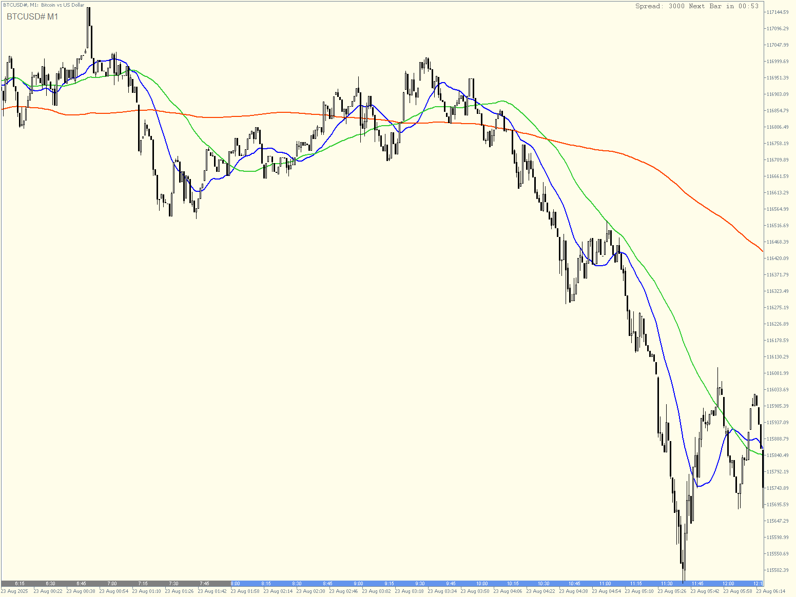

# BTCUSD Real-time Chart with EMA Indicators - E2E Test Suite

## 📋 概要

このテストスイートは、BTCUSDのリアルタイムチャート表示とEMA（指数移動平均）テクニカル指標の計算・表示機能を検証するEnd-to-Endテストです。MT5からリアルタイムデータを取得し、Plotlyを使用してインタラクティブなチャートを生成します。

## 🎯 テスト仕様

### 基本要件
- **通貨ペア**: BTCUSD（ビットコイン/米ドル）
- **時間枠**: M1（1分足）
- **表示要素**:
  - ローソク足チャート（OHLC）
  - EMA 20（青色）
  - EMA 50（緑色）
  - EMA 200（赤色）
  - ボリューム表示
  - リアルタイム更新機能

### 参考画像


## 📁 ファイル構成

```
task8_chart_test/
├── sample_img/
│   └── 2025-08-24_10h40_26.png        # 参考チャート画像
├── utils/
│   ├── test_config.py                  # テスト設定管理
│   └── chart_helpers.py                # チャート描画ヘルパー
├── 01_basic_ema_calculation.py         # EMA計算の基本テスト
├── 02_realtime_chart_display.py        # リアルタイムチャート表示
├── 03_marimo_interactive_chart.py      # インタラクティブダッシュボード
└── README.md                            # このファイル
```

## 🚀 セットアップ

### 前提条件
- Python 3.12以上
- MetaTrader 5がインストール済み
- BTCUSD#または他の通貨ペアが取引可能なMT5口座

### MT5認証情報の設定

プロジェクトルートの`.env`ファイルにMT5認証情報を設定してください：

```bash
# .envファイル
FOREX_MT5_LOGIN=your_login_id
FOREX_MT5_PASSWORD=your_password
FOREX_MT5_SERVER=your_server_name
FOREX_MT5_TIMEOUT=60000
```

**注意**: `.env`ファイルはセキュリティ上の理由からGitにコミットしないでください。

### 依存関係のインストール

```bash
# プロジェクトルートから実行
uv pip install polars numpy plotly rich marimo MetaTrader5 python-dotenv toml
```

## 🧪 テストスクリプト

### 1. 基本EMA計算テスト（01_basic_ema_calculation.py）

BTCUSDのヒストリカルデータを取得してEMAを計算し、結果を検証します。

```bash
uv run python test_sandbox/task8_test/task8_chart_test/01_basic_ema_calculation.py
```

**機能**:
- MT5からヒストリカルデータ取得
- EMA（20, 50, 200）の計算
- 計算結果の妥当性検証
- EMAクロスオーバーの検出
- 統計情報の表示

**設定オプション**:
- Quick test: 100バーのデータ
- Full test: 500バーのデータ（デフォルト）
- Performance test: 1000バーのデータ

### コマンドラインオプション

```bash
# シンボルを指定
uv run python 01_basic_ema_calculation.py --symbol BTCUSD#

# プリセットを使用
uv run python 01_basic_ema_calculation.py --preset quick

# EMA期間をカスタマイズ
uv run python 01_basic_ema_calculation.py --ema-periods "10,30,100"

# 複数のオプションを組み合わせ
uv run python 01_basic_ema_calculation.py --symbol EURUSD --preset performance
```

### 2. リアルタイムチャート表示（02_realtime_chart_display.py）

リアルタイムでティックデータを取得し、動的に更新されるチャートを表示します。

```bash
uv run python test_sandbox/task8_test/task8_chart_test/02_realtime_chart_display.py
```

**機能**:
- リアルタイムティック受信
- 1分足バーへの変換
- EMAの増分更新
- HTMLチャートの自動更新
- 進捗統計の表示

**動作**:
1. MT5に接続してデータ取得開始
2. ブラウザでチャートが自動的に開く
3. 1秒間隔でチャートが更新
4. Ctrl+Cで停止

### 3. Marimoインタラクティブダッシュボード（03_marimo_interactive_chart.py）

Webベースのインタラクティブなダッシュボードを提供します。

```bash
uv run marimo edit test_sandbox/task8_test/task8_chart_test/03_marimo_interactive_chart.py
```

**機能**:
- シンボル選択（BTCUSD, BTCUSD#など）
- タイムフレーム選択（M1, M5, M15, H1, H4）
- EMA期間のカスタマイズ
- ローソク足パターン検出
- マーケット統計表示
- リアルタイムティック表示

**使い方**:
1. ブラウザでダッシュボードが開く
2. Control Panelで設定を調整
3. "Fetch Data"ボタンでデータ取得
4. "Start Real-time"でリアルタイム更新開始

## 🔧 設定ファイル

### task8_config.toml

メイン設定ファイルで、チャート表示やEMA設定を管理します。

```toml
[chart]
symbol = "BTCUSD#"  # デフォルトシンボル
timeframe = "M1"
initial_bars = 500

[ema]
periods = [20, 50, 200]

[ema.colors]
20 = "blue"
50 = "green"
200 = "red"
```

### 設定の優先順位

1. **環境変数（.env）** - 最優先
2. **コマンドライン引数**
3. **task8_config.toml**
4. **デフォルト値**

### utils/test_config.py

### ChartConfig
```python
@dataclass
class ChartConfig:
    symbol: str = "BTCUSD"          # 取引シンボル
    timeframe: str = "M1"            # 時間枠
    ema_periods: List[int]           # EMA期間リスト
    ema_colors: Dict[int, str]       # EMA色設定
    chart_height: int = 800          # チャート高さ
    chart_width: int = 1200          # チャート幅
    initial_bars: int = 500          # 初期表示バー数
    update_interval: float = 1.0     # 更新間隔（秒）
```

### プリセット設定
- `quick_test`: 高速テスト用（100バー）
- `full_test`: 通常テスト用（500バー）
- `performance_test`: パフォーマンステスト用（1000バー）

## 📊 チャート表示機能

### ローソク足チャート
- 陽線: 緑色（#26a69a）
- 陰線: 赤色（#ef5350）
- ヒゲ: 高値・安値を表示

### EMAライン
- EMA 20: 青色（短期トレンド）
- EMA 50: 緑色（中期トレンド）
- EMA 200: 赤色（長期トレンド）

### ボリューム
- サブチャートに表示
- 陽線ボリューム: 緑色
- 陰線ボリューム: 赤色

## ✅ テスト検証項目

### データ検証
- [x] MT5接続の成功
- [x] BTCUSDシンボルの利用可能性
- [x] OHLCデータの整合性（high >= low, high >= open/close）
- [x] ボリュームデータの妥当性

### EMA計算検証
- [x] EMA値の数値範囲
- [x] NaN値の適切な処理
- [x] 各期間での正確な計算
- [x] クロスオーバーの検出

### リアルタイム機能
- [x] ティックデータの受信
- [x] 1分足への正確な変換
- [x] チャートの自動更新
- [x] メモリ管理（古いデータの削除）

## 🐛 トラブルシューティング

### MT5接続エラー
```
Error: MT5 initialization failed
```
**解決方法**:
- MetaTrader 5が起動していることを確認
- `.env`ファイルに正しい認証情報が設定されているか確認
- サーバー名が正しいか確認（"XMTrading-MT5 3"など）

### シンボルが見つからない
```
Error: Symbol BTCUSD# not available
```
**解決方法**:
- MT5のMarket Watchでシンボルを有効化
- 代替シンボルを試す：
  - 仮想通貨: BTCUSD#, ETHUSD#, Bitcoin
  - 為替: EURUSD, GBPUSD, USDJPY
- コマンドラインでシンボルを指定: `--symbol EURUSD`

### チャートが更新されない
**解決方法**:
- ブラウザのキャッシュをクリア
- `realtime_chart.html`を手動で再読み込み
- 更新間隔を長くする（例: 2秒）

## 📈 パフォーマンス最適化

### メモリ使用量の削減
- Float32データ型の使用
- 古いデータの自動削除
- 効率的なEMA増分更新

### 処理速度の向上
- 非同期処理による並行実行
- キューを使用したデータフロー管理
- 必要最小限のチャート再描画

## 🔄 今後の拡張案

1. **追加のテクニカル指標**
   - RSI（相対力指数）
   - MACD（移動平均収束拡散）
   - ボリンジャーバンド

2. **アラート機能**
   - EMAクロスオーバー通知
   - 価格アラート
   - パターン検出アラート

3. **データ保存機能**
   - CSVエクスポート
   - データベース保存
   - バックテスト用データセット作成

4. **マルチシンボル対応**
   - 複数通貨ペアの同時監視
   - 相関分析
   - ポートフォリオビュー

## 📝 注意事項

- **セキュリティ**: `.env`ファイルはGitにコミットしない
- **MT5認証**: 実際の認証情報は`.env`で管理
- **シンボル**: BTCUSD#が利用できない場合はEURUSD等を使用
- **市場時間**: 市場時間外はティックデータが更新されない
- **メモリ**: 大量のヒストリカルデータ取得時はメモリ使用量に注意
- **通信**: リアルタイム更新はネットワーク環境に依存

## 🤝 サポート

問題が発生した場合は、以下を確認してください：
1. MT5の接続状態
2. シンボルの利用可能性
3. Pythonパッケージのバージョン
4. ネットワーク接続

---

**Last Updated**: 2025-08-24
**Version**: 1.0.0
**Author**: Task 8 Test Implementation