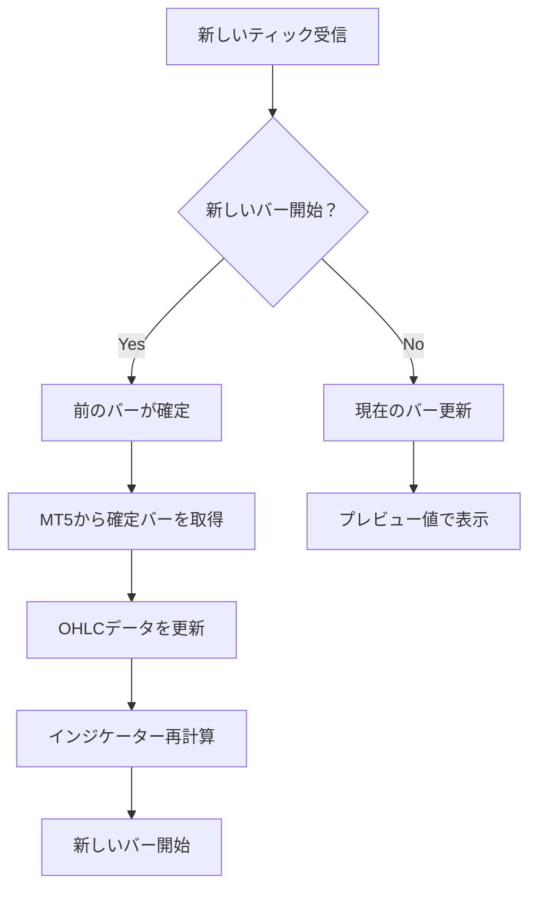

# MT5確定バー同期機能 - 実装ガイド

## 概要

このドキュメントは、`rci_realtime_chart.py`に実装されたMT5確定バー同期機能の詳細を記述しています。この機能により、リアルタイムチャートのデータ精度が大幅に向上し、MT5の公式データとの一致性が保証されます。

### 実装の背景

リアルタイムチャートでは、ティックデータから独自にOHLCバーを生成していましたが、以下の問題がありました：

1. **スリッページの影響**: ティック受信のタイミングによる微小な価格差
2. **ティック欠損**: ネットワーク遅延やティック受信の失敗
3. **集計の誤差**: ローカル集計とMT5サーバー側集計の差異

### 解決したこと

- バーが確定した時点でMT5から正確なOHLCデータを取得
- 確定したバーのデータを置き換えることで、MT5と完全に一致
- インジケーター（EMA、RCI）を正確な値で再計算

## 技術詳細

### バーインデックスの管理

```
[0] : 現在更新中の未完成バー（リアルタイム更新）
[1] : 直前に確定したバー（MT5データで更新対象）
[2] : それ以前の確定済みバー
...
[n] : 最古のバー
```

### 同期処理のフロー



## 実装の詳細

### 1. MT5確定バー取得メソッド

```python
def fetch_confirmed_bar_from_mt5(self, bar_time: datetime) -> Optional[Dict]:
    """
    MT5から指定時刻の確定バーデータを取得
    
    機能:
    - mt5.copy_rates_from()を使用して指定時刻の1本のバーを取得
    - エラーハンドリングとログ出力
    - numpy.float32型での返却（メモリ効率）
    """
```

**実装のポイント:**
- `copy_rates_from()`を使用して特定時刻のバーを正確に取得
- エラー時はNoneを返し、処理を継続（フェイルセーフ）

### 2. バー更新処理の改修

```python
def add_new_bar(self, bar: Bar):
    """
    新しいバーを追加（完成バー用）
    
    追加された処理:
    1. 前のバー（[1]）の時刻を特定
    2. MT5から確定データを取得
    3. _update_confirmed_bar()を呼び出して更新
    """
```

**実装のポイント:**
- バーの切り替わり時に前のバーの時刻を正確に特定
- 置き換えと新規追加の両パターンに対応

### 3. 確定バー更新メソッド

```python
def _update_confirmed_bar(self, bar_time: datetime, confirmed_bar: Dict):
    """
    確定バーをMT5データで更新し、インジケーターを再計算
    
    処理内容:
    1. OHLCデータ内の該当バーを検索
    2. Polarsデータフレームを再構築
    3. close価格の差異をログ出力
    4. EMAとRCIを再計算
    """
```

**実装のポイント:**
- Polarsの不変性を考慮したデータフレーム再構築
- 前後のデータを適切に結合
- デバッグ用の差分ログ出力

### 4. RCI再計算処理

```python
def _recalculate_rci_for_confirmed_bar(self, bar_index: int, confirmed_close: float):
    """
    確定バーのRCIを記録・追跡
    
    現在の制限:
    - DifferentialRCICalculatorには履歴修正機能がない
    - 将来的な拡張のための準備として実装
    """
```

## デバッグとモニタリング

### ログ出力の種類

1. **[MT5 Sync]** - MT5データ同期の詳細
   ```
   [MT5 Sync] Bar at 15:53:00: Close 162.345 -> 162.347
   [MT5 Sync] Successfully updated bar at 15:53:00 with MT5 data
   ```

2. **[Bar Complete]** - バー完成時の情報
   ```
   [Bar Complete] Period 9: RCI=45.23, Replacement=True, OHLC len=100, RCI len=100, Bar time=15:54:00
   ```

3. **[RCI Update]** - RCI値の更新情報
   ```
   [RCI Update] Period 9, Index 99: RCI value at confirmed close 162.347
   ```

### デバッグのポイント

- `abs(old_close - new_close) > 0.00001`で有意な差異のみログ出力
- バータイムスタンプを含めることで時系列を追跡可能
- データ長の一致性を常にチェック

## 実装の工夫点

### 1. データ整合性の維持

- バーインデックスと時刻の両方で管理
- データフレーム操作時の前後データの適切な処理
- None値の適切な処理

### 2. パフォーマンスの最適化

- 必要な時のみMT5からデータ取得
- EMAは全体再計算（依存性のため必須）
- RCIは将来的な個別更新を想定した設計

### 3. エラー耐性

- MT5接続エラー時も処理継続
- データ不整合時の自動修復機能
- 詳細なログによる問題追跡

## 今後の改善案

### 1. RCICalculatorの拡張

```python
# 将来的な実装案
class DifferentialRCICalculator:
    def update_historical_price(self, index: int, new_price: float):
        """過去の価格を更新してRCIを再計算"""
        pass
```

### 2. バッチ同期機能

- 複数のバーをまとめてMT5から取得
- 起動時の初期同期の高速化

### 3. 差分検証機能

- MT5データとローカルデータの定期的な検証
- 差異の統計情報収集

## 使用例

```python
# チャートマネージャーの初期化
chart_manager = RCIRealtimeChart(config)

# リアルタイム更新開始（自動的にMT5同期が有効）
chart_manager.start_realtime()

# バーが確定すると自動的に：
# 1. MT5から確定データ取得
# 2. OHLCデータ更新
# 3. インジケーター再計算
# 4. チャート表示更新
```

## まとめ

この実装により、以下が実現されました：

✅ **データの正確性**: MT5の公式データとの完全な一致  
✅ **インジケーターの信頼性**: 確定した正確な値での計算  
✅ **透明性**: 詳細なログによる動作の可視化  
✅ **拡張性**: 将来的な機能追加を考慮した設計  

リアルタイムチャートの精度と信頼性が大幅に向上し、プロフェッショナルな取引環境の構築が可能になりました。